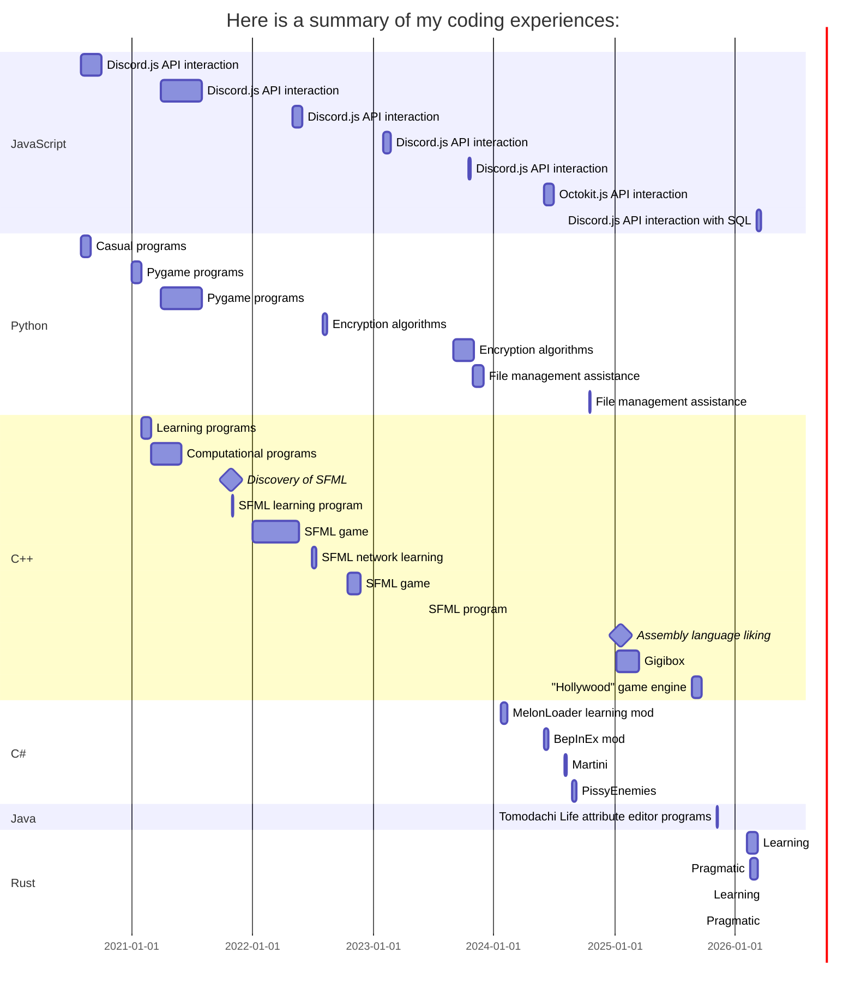

<h1 align="center">Hello, I'm Simone</h1>

(This is not a complete teardown of my experiences but a superficial explaination of them)

Coding is my greatest passion alongside other minor hobbies, having a total of almost 6 years of experience with coding in general.

## What I mainly code:
  - Videogames and videogames related concepts
  - Programs to ease tasks
  - Modifications and patches for videogames (Mods)

## Ongoing and future projects:
  - Pragmatic. A coding language to turn dinamically defined keywords into a static, hardcoded file.
  - Hollywood Engine. My idea of a perfect game engine, made in SDL.

<h4 align="center">I plan on making many more projects in the future.</h4>
